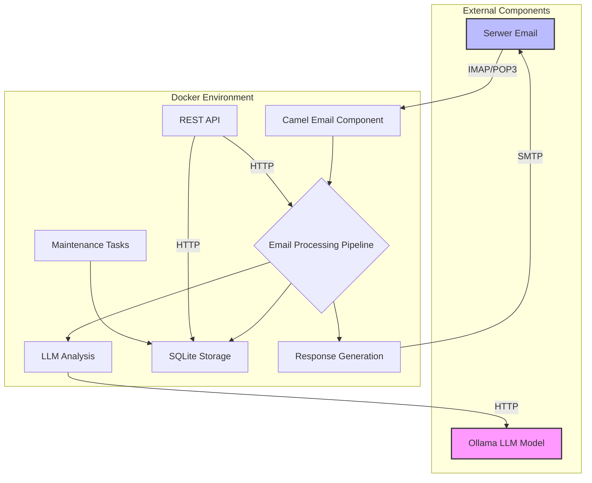
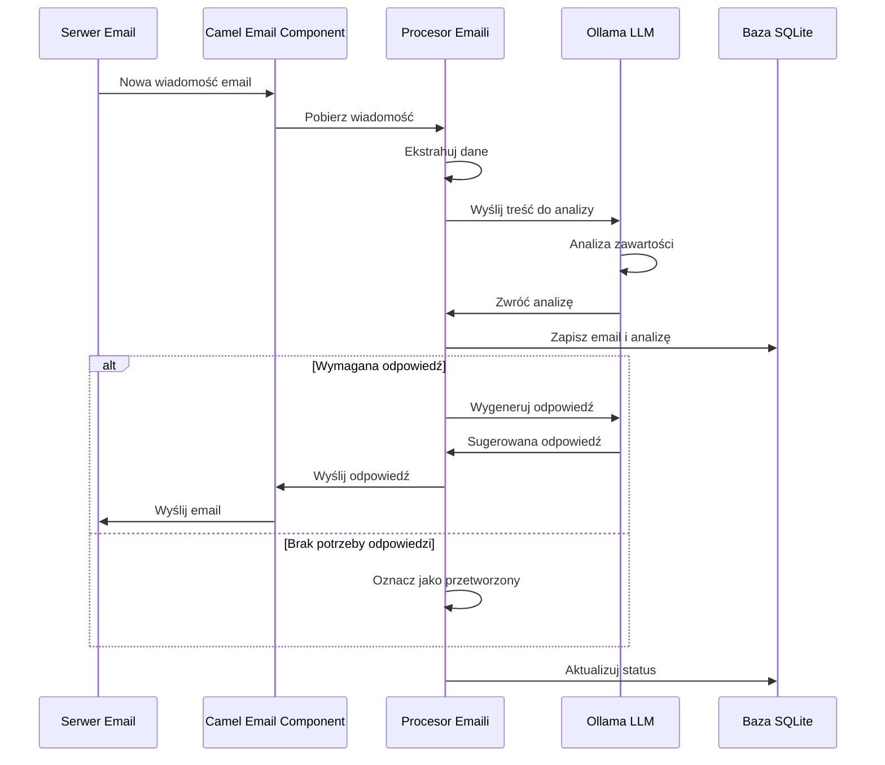
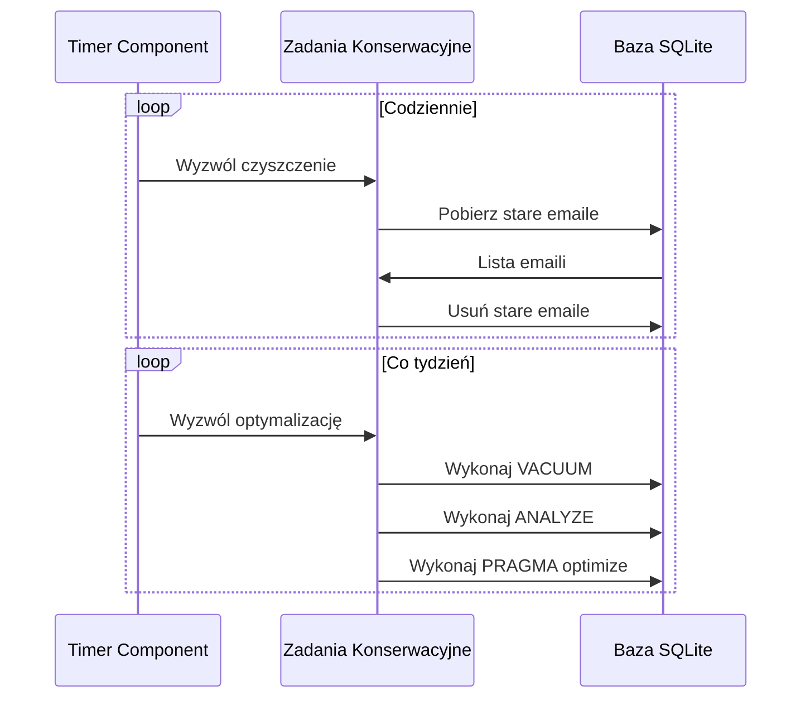
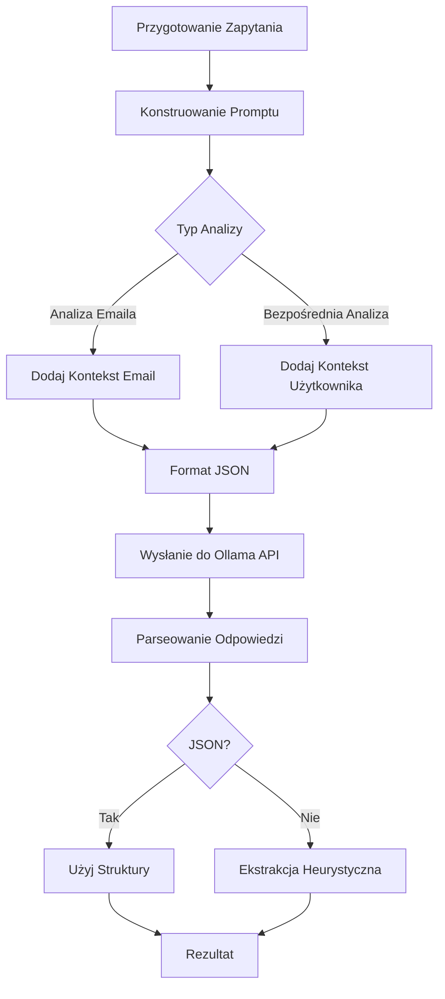

# Dokumentacja Projektu Email-LLM Integration

## Spis treści
1. [Przegląd projektu](#przegląd-projektu)
2. [Architektura systemu](#architektura-systemu)
3. [Przepływy danych](#przepływy-danych)
4. [Komponenty systemu](#komponenty-systemu)
5. [Konfiguracja](#konfiguracja)
6. [API REST](#api-rest)
7. [Obsługa SQLite](#obsługa-sqlite)
8. [Integracja z Ollama LLM](#integracja-z-ollama-llm)
9. [Rozszerzanie systemu](#rozszerzanie-systemu)
10. [Najlepsze praktyki](#najlepsze-praktyki)

## Przegląd projektu

Email-LLM Integration to system, który integruje serwer pocztowy z lokalnymi modelami uczenia maszynowego (LLM) za pomocą Apache Camel i języka Groovy. Głównym celem systemu jest automatyczne przetwarzanie przychodzących wiadomości email, analiza ich zawartości za pomocą modeli LLM oraz generowanie odpowiednich odpowiedzi.

### Główne funkcje:

- Monitorowanie skrzynki pocztowej i pobieranie nowych wiadomości
- Przetwarzanie wiadomości email (ekstrahowanie danych, analizowanie zawartości)
- Integracja z lokalnym modelem LLM (Ollama) do analizy treści
- Przechowywanie danych w zoptymalizowanej bazie SQLite
- Automatyczne generowanie i wysyłanie odpowiedzi
- API REST do zarządzania systemem
- Zadania konserwacyjne (czyszczenie starych wiadomości, optymalizacja bazy danych)

## Architektura systemu

### Diagram architektury (Mermaid)



### Architektura w ASCII

```
+---------------------------+     +-------------------------------------------+
|                           |     |              Docker Environment           |
|    External Components    |     |                                           |
|                           |     |  +-------------+      +---------------+   |
|  +-----------------+      |     |  |             |      |               |   |
|  |                 |      |     |  | Camel Email |      | Email Process |   |
|  |  Email Server   |<---->|---->|--| Component   |----->| Pipeline      |   |
|  |  (IMAP/SMTP)    |      |     |  |             |      |               |   |
|  +-----------------+      |     |  +-------------+      +-------+-------+   |
|                           |     |                               |           |
|  +-----------------+      |     |  +-------------+      +-------v-------+   |
|  |                 |      |     |  |             |      |               |   |
|  |  Ollama LLM     |<---->|---->|--| HTTP Client |<-----+ LLM Analysis  |   |
|  |  Model          |      |     |  |             |      |               |   |
|  +-----------------+      |     |  +-------------+      +---------------+   |
|                           |     |                                           |
+---------------------------+     |  +-------------+      +---------------+   |
                                  |  |             |      |               |   |
                                  |  | REST API    |----->| SQLite DB     |   |
                                  |  | Controller  |      |               |   |
                                  |  +-------------+      +-------^-------+   |
                                  |                               |           |
                                  |  +-------------+      +-------+-------+   |
                                  |  |             |      |               |   |
                                  |  | Scheduled   |----->| Maintenance   |   |
                                  |  | Tasks       |      | Tasks         |   |
                                  |  +-------------+      +---------------+   |
                                  |                                           |
                                  +-------------------------------------------+
```

## Przepływy danych

### Główny przepływ przetwarzania emaili (Mermaid)



### Przepływ zadań konserwacyjnych (Mermaid)



### Przepływ REST API (ASCII)

```
+--------+      +---------------+      +-------------+      +---------------+
|        |      |               |      |             |      |               |
| Klient +----->+ Kontroler REST+----->+ Trasa Camel +----->+ Serwis/Repozy |
|        |      |               |      |             |      | torium        |
+--------+      +---------------+      +-------------+      +------+--------+
                                                                   |
                                          +----------------------+  |
                                          |                      |  |
                                          |  Rezultat operacji   <--+
                                          |                      |
                                          +--------+-------------+
                                                   |
+--------+      +---------------+      +----------v------+
|        |      |               |      |                 |
| Klient <------+ Kontroler REST<------+ Odpowiedź JSON  |
|        |      |               |      |                 |
+--------+      +---------------+      +-----------------+
```

## Komponenty systemu

### 1. Apache Camel
Centralna część systemu, która obsługuje integrację różnych komponentów i definiuje trasy przepływu danych. Wykorzystuje deklaratywne podejście Groovy DSL.

Najważniejsze komponenty Camel:
- **camel-mail**: Integracja z serwerem pocztowym (SMTP, IMAP, POP3)
- **camel-http**: Komunikacja z API modelu Ollama
- **camel-jdbc/sql**: Operacje na bazie SQLite
- **camel-quartz**: Zaplanowane zadania
- **camel-rest**: Wystawienie API REST

### 2. Model Ollama LLM
Lokalny model językowy wykorzystywany do analizy treści emaili i generowania odpowiedzi. Komunikacja z modelem odbywa się przez interfejs HTTP API.

### 3. Baza danych SQLite
Przechowuje wszystkie przetworzone emaile, ich analizy i metadane. Zoptymalizowana pod kątem wydajności za pomocą różnych ustawień PRAGMA.

### 4. Serwer Email
Zewnętrzny komponent dostarczający i odbierający wiadomości email. W środowisku developerskim zastąpiony przez MailHog.

### 5. Docker Compose
Zarządza kontenerami i definiuje zależności między komponentami systemu.

## Konfiguracja

### Konfiguracja środowiska (.env)

```
# Konfiguracja serwera email
EMAIL_HOST=test-smtp.example.com          # Adres serwera SMTP
EMAIL_PORT=587                           # Port SMTP
EMAIL_USER=test@example.com              # Nazwa użytkownika
EMAIL_PASSWORD=test_password             # Hasło
EMAIL_USE_TLS=true                       # Użycie TLS
EMAIL_IMAP_HOST=test-imap.example.com    # Adres serwera IMAP
EMAIL_IMAP_PORT=993                      # Port IMAP
EMAIL_IMAP_FOLDER=INBOX                  # Folder do monitorowania

# Konfiguracja Ollama
OLLAMA_HOST=http://ollama:11434          # Adres serwera Ollama
OLLAMA_MODEL=mistral                     # Nazwa modelu
OLLAMA_API_KEY=                          # Klucz API (opcjonalny)

# Konfiguracja SQLite
SQLITE_DB_PATH=/data/emails.db           # Ścieżka do bazy danych
SQLITE_JOURNAL_MODE=WAL                  # Tryb dziennika (WAL, DELETE, TRUNCATE)
SQLITE_CACHE_SIZE=102400                 # Rozmiar pamięci podręcznej (w KB)
SQLITE_SYNCHRONOUS=NORMAL                # Tryb synchronizacji (NORMAL, FULL, OFF)

# Konfiguracja Apache Camel
CAMEL_DEBUG=false                        # Tryb debugowania
CAMEL_TRACING=false                      # Śledzenie tras
CAMEL_SHUTDOWN_TIMEOUT=10                # Timeout zamykania (sekundy)
CAMEL_ROUTES_RELOAD_DIRECTORY=/app/routes # Katalog z trasami do przeładowania
CAMEL_STREAM_CACHE_ENABLED=true          # Buforowanie strumieni

# Konfiguracja aplikacji Spring Boot
SERVER_PORT=8080                         # Port serwera
SPRING_PROFILES_ACTIVE=dev               # Aktywny profil
```

### Konfiguracja aplikacji (application.yml)

Główne sekcje pliku application.yml:

- **server**: Konfiguracja serwera HTTP
- **spring**: Konfiguracja frameworka Spring
- **sqlite**: Konfiguracja połączenia z bazą SQLite
- **email**: Konfiguracja połączeń email
- **ollama**: Konfiguracja integratora LLM
- **maintenance**: Konfiguracja zadań konserwacyjnych
- **camel**: Konfiguracja Apache Camel
- **logging**: Konfiguracja logowania

## API REST

### Dostępne endpointy

| Endpoint | Metoda | Opis | Parametry |
|----------|--------|------|-----------|
| `/api/health` | GET | Sprawdzenie stanu aplikacji | - |
| `/api/emails` | GET | Pobieranie listy emaili | `status`, `page`, `size` |
| `/api/emails/{id}` | GET | Pobieranie szczegółów emaila | `id` |
| `/api/emails/{id}` | PUT | Aktualizacja statusu emaila | `id`, `body` |
| `/api/llm/direct-analyze` | POST | Bezpośrednia analiza tekstu | `text`, `context` |
| `/api/maintenance/cleanup` | POST | Ręczne wywołanie czyszczenia | `days` |
| `/api/maintenance/optimize` | POST | Ręczne wywołanie optymalizacji | - |

### Przykład żądania analizy LLM

```json
{
  "text": "Dzień dobry, chciałbym zapytać o status mojego zamówienia #12345.",
  "context": "Klient wielokrotnie kontaktował się w sprawie zamówienia."
}
```

### Przykład odpowiedzi analizy LLM

```json
{
  "result": {
    "keyTopics": ["status zamówienia", "obsługa klienta"],
    "priority": "high",
    "requiresResponse": true,
    "actionRequired": true,
    "summary": "Klient pyta o status zamówienia #12345",
    "suggestedResponse": "Dzień dobry, dziękuję za wiadomość. Sprawdziłem status zamówienia #12345 - jest obecnie w trakcie realizacji i zostanie wysłane w ciągu 2 dni roboczych. W razie dodatkowych pytań, proszę o kontakt."
  },
  "model": "mistral",
  "processing_time": 0.842,
  "timestamp": "2025-05-17T12:34:56"
}
```

## Obsługa SQLite

### Optymalizacje SQLite

W projekcie zastosowano następujące optymalizacje SQLite:

1. **Tryb WAL (Write-Ahead Logging)**: Umożliwia jednoczesne operacje odczytu i zapisu
2. **PRAGMA synchronous=NORMAL**: Zmniejsza liczbę operacji synchronizacji z dyskiem
3. **PRAGMA cache_size**: Zwiększa rozmiar pamięci podręcznej dla lepszej wydajności
4. **PRAGMA temp_store=MEMORY**: Przechowuje tabele tymczasowe w pamięci
5. **PRAGMA mmap_size**: Wykorzystuje mapowanie pamięci dla szybszego odczytu

### Schemat bazy danych

```
+---------------------+       +---------------------+
| processed_emails    |       | email_attachments   |
+---------------------+       +---------------------+
| id (PK)             |       | id (PK)             |
| message_id          |<---+  | email_id (FK)       |
| subject             |    |  | filename            |
| sender              |    |  | content_type        |
| recipients          |    |  | size                |
| received_date       |    |  | content             |
| processed_date      |    |  +---------------------+
| body_text           |    |
| body_html           |    |
| status              |    |
| llm_analysis        |    |
| metadata            |    |
+---------------------+    |
         ^                 |
         |                 |
         +-----------------+
```

## Integracja z Ollama LLM

### Schemat zapytania do LLM



### Przykładowy prompt dla Ollama

```
Przeanalizuj poniższą wiadomość email i:
1. Wyodrębnij kluczowe informacje i tematy
2. Określ priorytet i pilność
3. Zidentyfikuj czy wymagane są działania lub odpowiedzi
4. Zaproponuj krótką odpowiedź, jeśli jest potrzebna

=== WIADOMOŚĆ EMAIL ===
Od: klient@example.com
Do: support@nasza-firma.com
Temat: Problem z zamówieniem #12345

Dzień dobry,
Złożyłem zamówienie #12345 dwa dni temu, ale nadal nie otrzymałem potwierdzenia wysyłki. 
Czy moglibyście sprawdzić co się dzieje? Potrzebuję tych produktów na piątek.

Z poważaniem,
Jan Kowalski

Odpowiedz w formacie JSON z następującymi polami:
{
  "keyTopics": ["temat1", "temat2"],
  "priority": "high/medium/low",
  "requiresResponse": true/false,
  "actionRequired": true/false,
  "summary": "krótkie podsumowanie",
  "suggestedResponse": "proponowana odpowiedź jeśli jest potrzebna"
}
```

## Rozszerzanie systemu

### Dodawanie nowych tras

Nowe trasy można dodawać na 3 sposoby:

1. **Dodanie trasy w istniejących klasach** (np. EmailProcessingRoute.groovy)
2. **Utworzenie nowej klasy rozszerzającej RouteBuilder**
3. **Utworzenie dynamicznej trasy w katalogu routes**

Przykład dynamicznej trasy (plik .groovy w katalogu routes):

```groovy
// Definiowanie trasy
def route = {
    from("direct:newCustomRoute")
        .routeId("new-custom-route")
        .log("Przetwarzanie własnej trasy")
        .process { exchange -> 
            // Kod przetwarzania
        }
        .to("direct:anotherRoute")
}

// Zwrócenie definicji trasy do automatycznego załadowania
return route
```

### Dodawanie nowych integracji

System można rozszerzyć o integracje z innymi systemami, wykorzystując gotowe komponenty Apache Camel:

- **Bazy danych**: PostgreSQL, MySQL, MongoDB, etc.
- **Kolejki wiadomości**: Apache Kafka, RabbitMQ, ActiveMQ
- **Chmura**: AWS, Azure, Google Cloud
- **Media społecznościowe**: Twitter, Facebook, etc.
- **Inne protokoły**: FTP, SFTP, JMS, SOAP, GraphQL, etc.

## Najlepsze praktyki

### Projektowanie tras Camel

1. **Używaj deskryptywnych identyfikatorów tras** (`routeId`): ułatwia to debugowanie i monitorowanie
2. **Dziel złożone trasy na mniejsze podtrasy**: używaj `direct:` lub `seda:` do łączenia
3. **Obsługuj błędy**: wykorzystuj `errorHandler` i `onException`
4. **Używaj procesorów do złożonej logiki**: oddzielaj logikę biznesową od definicji tras
5. **Monitoruj wydajność**: dodawaj metryki i logi w kluczowych miejscach

### Optymalizacja SQLite

1. **Używaj indeksów** dla często wyszukiwanych kolumn
2. **Wykorzystuj transakcje** dla wielu operacji zapisu
3. **Regularnie uruchamiaj VACUUM** do odzyskiwania miejsca
4. **Monitoruj rozmiar bazy danych** i usuwaj zbędne dane
5. **Unikaj bloków `BLOB` bezpośrednio w bazie** dla dużych załączników

### Integracja z LLM

1. **Optymalizuj prompty** dla lepszych wyników
2. **Implementuj retry z backoff** dla komunikacji z API
3. **Cachuj popularne zapytania** dla lepszej wydajności
4. **Monitoruj używanie tokenów** dla kontroli kosztów
5. **Testuj różne modele** dla porównania wyników